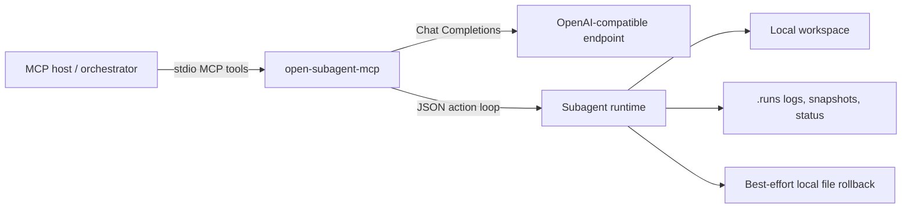

# Open Subagent MCP

English | [简体中文](./README.md)

Local stdio MCP server that lets an MCP host delegate work to an
OpenAI-compatible subagent runtime.

Open Subagent MCP is meant for developer workstations. It can read files, write
files, run commands, record side effects, and perform best-effort rollback of
local file changes. It is not a sandbox, not a hosted service, and not
production isolation.

## What It Is

- A local MCP server started by a host such as Codex, Claude Code, or another
  MCP-compatible client.
- A small subagent runtime backed by any OpenAI-compatible Chat Completions
  endpoint.
- A structured action loop for code tasks: read, search, map a repo, run tests,
  patch files, capture logs, and finish with auditable evidence.
- A best-effort local file rollback system based on snapshots, write logs, and
  command side-effect scans.

## What It Is Not

- It is not a container sandbox or security boundary.
- It does not roll back network calls, external services, databases, long-lived
  processes, or production operations.
- It does not make your model endpoint trustworthy. The user or organization
  must decide which endpoint may receive workspace content.
- `request_main_tool` is not an MCP standard feature. It is a structured
  host/orchestrator broker request used when the subagent needs capabilities the
  runtime does not own.

## Architecture



## Quick Start

```bash
git clone https://github.com/g2zz/open-subagent-mcp.git
cd open-subagent-mcp
python3.11 -m venv .venv
. .venv/bin/activate
pip install -e ".[dev]"
```

Configure an OpenAI-compatible endpoint:

```bash
export OPENAI_BASE_URL="http://localhost:8000/v1"
export OPENAI_API_KEY="your-api-key"
export OPENAI_MODEL_NAME="your-model-name"
```

Run local checks:

```bash
pytest -q
python scripts/smoke_mcp_stdio.py
```

## Codex Setup

Add the server to `~/.codex/config.toml`:

```toml
[mcp_servers.open_subagent_mcp]
command = "/absolute/path/to/open-subagent-mcp/.venv/bin/open-subagent-mcp"
args = []
startup_timeout_sec = 20
tool_timeout_sec = 180

[mcp_servers.open_subagent_mcp.env]
OPENAI_BASE_URL = "http://localhost:8000/v1"
OPENAI_API_KEY = "your-api-key"
OPENAI_MODEL_NAME = "your-model-name"
```

Restart Codex after changing MCP configuration.

## Claude Code Setup

Claude Code can add local stdio MCP servers with the form documented in the
official Claude Code MCP docs:

```bash
claude mcp add --transport stdio open-subagent-mcp \
  --env OPENAI_BASE_URL=http://localhost:8000/v1 \
  --env OPENAI_API_KEY=your-api-key \
  --env OPENAI_MODEL_NAME=your-model-name \
  -- /absolute/path/to/open-subagent-mcp/.venv/bin/open-subagent-mcp
```

The `--` separator is important: everything after it is the server command and
arguments. Claude Code sets `CLAUDE_PROJECT_DIR` for stdio servers, but Open
Subagent MCP expects each `subagent_spawn` call to pass an explicit `cwd`.

Claude Code warns when MCP tool output is large. Open Subagent MCP returns log
paths and truncated previews to keep tool output bounded.

## Other MCP Hosts

Use the standard stdio server shape supported by your host:

```json
{
  "mcpServers": {
    "open_subagent_mcp": {
      "command": "/absolute/path/to/open-subagent-mcp/.venv/bin/open-subagent-mcp",
      "args": [],
      "env": {
        "OPENAI_BASE_URL": "http://localhost:8000/v1",
        "OPENAI_API_KEY": "your-api-key",
        "OPENAI_MODEL_NAME": "your-model-name"
      }
    }
  }
}
```

Open Subagent MCP only assumes standard MCP stdio and standard tool schemas. Host
features such as approval UI, project trust, skill systems, browser tools, or
tool brokers vary by host.

## Provider Examples

Open Subagent MCP talks to an OpenAI-compatible Chat Completions endpoint. Common
options include:

- A local gateway such as LiteLLM at `http://localhost:8000/v1`.
- A local model app that exposes an OpenAI-compatible API.
- A company-managed OpenAI-compatible endpoint that your organization allows to
  receive workspace content.
- The official OpenAI API, if your policy allows the target workspace content to
  be sent there.

The endpoint must return assistant text containing exactly one JSON action per
turn. Use the smoke tests before trusting a new provider for real work.

## MCP Tools

The server exposes five MCP tools:

- `subagent_spawn`: start a run. Use `agent_type="explorer"` for read-only work
  and `agent_type="worker"` for writable work.
- `subagent_wait`: wait for one or more runs. Returns statuses, summaries,
  changed files, command logs, command effects, and rollback segments.
- `subagent_send_message`: send a follow-up message to an existing run. Each
  follow-up creates a rollback segment.
- `subagent_close`: close a run and release runtime state.
- `subagent_rollback`: best-effort rollback of recorded local file changes for a
  whole run or one segment.

Runs may end as `completed`, `failed`, `waiting_input`, `interrupted`, `closed`,
`rolled_back`, or `partially_rolled_back`.

When the subagent needs a capability it does not own, it can use
`request_main_tool`. The run then returns `waiting_input` with
`requested_main_tool`. The MCP host or orchestrator may call or decline the
requested capability and continue the run with `subagent_send_message`.

## Runtime Environment

Provider variables:

- `OPENAI_BASE_URL`
- `OPENAI_API_KEY`
- `OPENAI_MODEL_NAME`

Runtime variables:

- `SUBAGENT_MCP_RUNS_DIR`
- `SUBAGENT_MCP_MAX_CONCURRENCY`
- `SUBAGENT_MCP_MAX_STEPS`
- `SUBAGENT_MCP_DEFAULT_COMMAND_TIMEOUT_SECONDS`
- `SUBAGENT_MCP_LOG_TRUNCATE_CHARS`
- `SUBAGENT_MCP_SNAPSHOT_IGNORE_DIRS`
- `SUBAGENT_MCP_SENSITIVE_PATH_PATTERNS`
- `SUBAGENT_MCP_FAKE_LLM_OUTPUTS`

## Security And Rollback

Open Subagent MCP can read files, write files, and run commands in a local
workspace. Review `SECURITY.md` before connecting it to private repositories or
untrusted model endpoints.

Protections include path normalization, allowed root checks, sensitive path
blocking, read-only explorer mode, schema validation for subagent actions, local
logs, snapshots, command side-effect scans, and rollback metadata.

Rollback is best-effort local file rollback. It does not undo network requests,
database writes, cloud actions, production operations, or effects outside the
recorded file changes.

For stdio transport, MCP requires stdout to contain only valid MCP messages.
Open Subagent MCP logs through files or stderr-compatible server mechanisms; do
not add `print()` calls to server startup or tool code.

## Evals

Deterministic checks:

```bash
pytest -q
ruff check .
python scripts/smoke_mcp_stdio.py
python scripts/eval_runtime_fake.py
python scripts/eval_mcp_blackbox.py
python scripts/eval_security_adversarial.py
```

Real provider smoke:

```bash
OPENAI_BASE_URL=http://localhost:8000/v1 \
OPENAI_API_KEY=your-api-key \
OPENAI_MODEL_NAME=your-model-name \
RUN_REAL_LLM_SMOKE=1 \
python scripts/smoke_openai_compatible.py
```

Real provider canary:

```bash
OPENAI_BASE_URL=http://localhost:8000/v1 \
OPENAI_API_KEY=your-api-key \
OPENAI_MODEL_NAME=your-model-name \
RUN_REAL_LLM_EVAL=1 \
python scripts/eval_real_subagent_canary.py
```

Real provider evals are intentionally manual and are not part of default CI.

## Migration

If you used the earlier legacy local version, see
`docs/MIGRATING_FROM_LEGACY_LOCAL_VERSION.md`.
