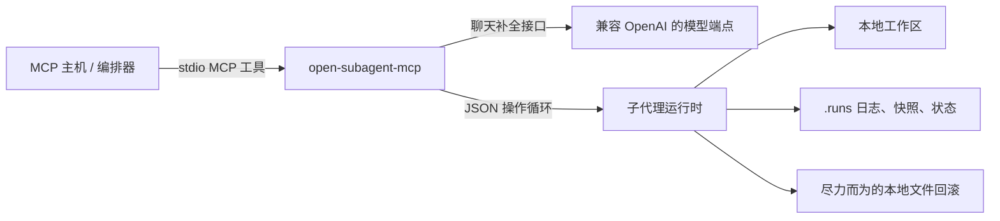

# Open Subagent MCP

[English](./README.en.md) | 简体中文

这是一个基于标准输入输出 (stdio) 的本地 MCP 服务器，允许 MCP 主机将任务委托给兼容 OpenAI 接口的子代理 (Subagent) 运行时执行。

Open Subagent MCP 专为开发者工作站设计。它可以读取文件、写入文件、执行命令、记录副作用 (side effects)，并尽最大努力回滚对本地文件所做的修改。它**不是**沙盒，**不是**托管服务，也**不提供**生产级别的隔离。

## 功能特性

- 它是一个可由 Codex、Claude Code 或其他兼容 MCP 的客户端启动的本地 MCP 服务器。
- 内置一个轻量级的子代理运行时，后端可接入任何兼容 OpenAI 接口的大模型 (Chat Completions) 服务。
- 提供一套处理代码任务的结构化操作循环：包括读取、搜索、解析代码库、运行测试、修改文件、捕获日志，并最终生成可审计的执行凭证。
- 提供一个基于快照、写入日志以及命令副作用扫描的文件回滚系统（尽力而为机制）。

## 非目标特性

- 它不是容器沙盒，也不提供安全边界。
- 它不会回滚网络请求、外部服务调用、数据库更改、长时间运行的进程或生产环境的操作。
- 它不能保证您的模型服务端点是绝对可信的。用户或组织必须自行评估并决定哪个服务端点可以接收您的工作区代码。
- `request_main_tool` 并非 MCP 的标准功能。它是一种结构化的主机/编排器请求机制，用于在子代理需要运行时本身不具备的能力时向外寻求协助。

## 架构



## 快速开始

```bash
git clone https://github.com/g2zz/open-subagent-mcp.git
cd open-subagent-mcp
python3.11 -m venv .venv
. .venv/bin/activate
pip install -e ".[dev]"
```

配置兼容 OpenAI 的模型端点：

```bash
export OPENAI_BASE_URL="http://localhost:8000/v1"
export OPENAI_API_KEY="your-api-key"
export OPENAI_MODEL_NAME="your-model-name"
```

运行本地检查：

```bash
pytest -q
python scripts/smoke_mcp_stdio.py
```

## Codex 配置

将服务器添加到 `~/.codex/config.toml` 中：

```toml
[mcp_servers.open_subagent_mcp]
command = "/absolute/path/to/open-subagent-mcp/.venv/bin/open-subagent-mcp"
args = []
startup_timeout_sec = 20
tool_timeout_sec = 180

[mcp_servers.open_subagent_mcp.env]
OPENAI_BASE_URL = "http://localhost:8000/v1"
OPENAI_API_KEY = "your-api-key"
OPENAI_MODEL_NAME = "your-model-name"
```

修改 MCP 配置后请重启 Codex。

## Claude Code 配置

Claude Code 可以按照官方 MCP 文档的方式添加本地 stdio MCP 服务器：

```bash
claude mcp add --transport stdio open-subagent-mcp \
  --env OPENAI_BASE_URL=http://localhost:8000/v1 \
  --env OPENAI_API_KEY=your-api-key \
  --env OPENAI_MODEL_NAME=your-model-name \
  -- /absolute/path/to/open-subagent-mcp/.venv/bin/open-subagent-mcp
```

注意 `--` 分隔符非常重要：它后面的所有内容都会被视为服务器的启动命令及参数。Claude Code 会为 stdio 服务器设置 `CLAUDE_PROJECT_DIR`，但 Open Subagent MCP 要求每次调用 `subagent_spawn` 时都必须显式传入 `cwd`。

当 MCP 工具的输出过大时，Claude Code 会发出警告。因此，Open Subagent MCP 会返回日志文件的路径和截断后的预览内容，以控制工具输出的体积。

## 其他 MCP 主机

请使用您的主机支持的标准 stdio 服务器格式进行配置：

```json
{
  "mcpServers": {
    "open_subagent_mcp": {
      "command": "/absolute/path/to/open-subagent-mcp/.venv/bin/open-subagent-mcp",
      "args": [],
      "env": {
        "OPENAI_BASE_URL": "http://localhost:8000/v1",
        "OPENAI_API_KEY": "your-api-key",
        "OPENAI_MODEL_NAME": "your-model-name"
      }
    }
  }
}
```

Open Subagent MCP 仅依赖于标准 MCP stdio 通信和标准的工具 Schema。诸如审批 UI、项目信任机制、技能系统、浏览器工具或工具代理等功能，均由您的 MCP 主机决定和提供。

## 模型接入示例

Open Subagent MCP 通过兼容 OpenAI 的 Chat Completions 接口与模型通信。常见的接入方式包括：

- 本地网关，例如运行在 `http://localhost:8000/v1` 的 LiteLLM。
- 提供兼容 OpenAI API 的本地模型应用。
- 您的组织内部署的、且被允许接收工作区代码的兼容 OpenAI 端点。
- 官方的 OpenAI API（前提是您的数据安全策略允许将工作区代码发送至云端）。

模型端点必须在每次对话的回复文本中返回**且仅返回一个**有效的 JSON 操作指令。在将新的模型服务投入实际工作前，请务必先运行冒烟测试。

## MCP 工具列表

本服务器暴露了以下五个 MCP 工具：

- `subagent_spawn`：启动一次执行任务（run）。传入 `agent_type="explorer"` 进行只读探索，传入 `agent_type="worker"` 进行允许修改的工作。
- `subagent_wait`：等待一个或多个任务执行完毕。返回状态、摘要、被修改的文件、命令日志、副作用记录以及回滚分段信息。
- `subagent_send_message`：向正在执行的任务发送追加消息。每次发送都会生成一个新的回滚分段。
- `subagent_close`：关闭任务并释放运行时状态。
- `subagent_rollback`：尽最大努力回滚整个任务或单个分段中对本地文件造成的修改。

任务（Runs）的最终状态可能为：`completed`（已完成）、`failed`（失败）、`waiting_input`（等待输入）、`interrupted`（被中断）、`closed`（已关闭）、`rolled_back`（已回滚）或 `partially_rolled_back`（部分回滚）。

当子代理需要运行时本身不具备的能力时，它可以调用 `request_main_tool`。此时任务状态将变为 `waiting_input` 并附带 `requested_main_tool` 信息。MCP 主机或编排器可以选择执行或拒绝该请求，随后通过 `subagent_send_message` 恢复任务的执行。

## 运行时环境变量

模型服务变量：

- `OPENAI_BASE_URL`
- `OPENAI_API_KEY`
- `OPENAI_MODEL_NAME`

运行时控制变量：

- `SUBAGENT_MCP_RUNS_DIR`
- `SUBAGENT_MCP_MAX_CONCURRENCY`
- `SUBAGENT_MCP_MAX_STEPS`
- `SUBAGENT_MCP_DEFAULT_COMMAND_TIMEOUT_SECONDS`
- `SUBAGENT_MCP_LOG_TRUNCATE_CHARS`
- `SUBAGENT_MCP_SNAPSHOT_IGNORE_DIRS`
- `SUBAGENT_MCP_SENSITIVE_PATH_PATTERNS`
- `SUBAGENT_MCP_FAKE_LLM_OUTPUTS`

## 安全与回滚机制

Open Subagent MCP 会在本地工作区读取文件、写入文件和执行命令。在将其连接到私有代码库或不受信任的模型端点前，请务必阅读 `SECURITY.md`。

内置的安全保护措施包括：路径规范化、允许的根目录校验、敏感路径拦截、只读的资源管理器模式、对子代理操作进行严格的 Schema 验证、本地日志记录、文件快照、命令副作用扫描以及回滚元数据记录。

回滚功能是**尽力而为**的本地文件还原机制。它**无法**撤销网络请求、数据库写入、云端操作、生产环境变更或任何超出文件系统监控范围的影响。

在使用 stdio 传输时，MCP 协议要求标准输出（stdout）必须只包含合法的 MCP 消息。Open Subagent MCP 会将日志写入文件或通过标准错误（stderr）机制输出；**严禁**在服务器启动过程或工具代码中使用原生的 `print()` 打印调试信息。

## 评估与测试 (Evals)

确定性基础检查：

```bash
pytest -q
ruff check .
python scripts/smoke_mcp_stdio.py
python scripts/eval_runtime_fake.py
python scripts/eval_mcp_blackbox.py
python scripts/eval_security_adversarial.py
```

真实模型冒烟测试：

```bash
OPENAI_BASE_URL=http://localhost:8000/v1 \
OPENAI_API_KEY=your-api-key \
OPENAI_MODEL_NAME=your-model-name \
RUN_REAL_LLM_SMOKE=1 \
python scripts/smoke_openai_compatible.py
```

真实模型高阶测试（Canary）：

```bash
OPENAI_BASE_URL=http://localhost:8000/v1 \
OPENAI_API_KEY=your-api-key \
OPENAI_MODEL_NAME=your-model-name \
RUN_REAL_LLM_EVAL=1 \
python scripts/eval_real_subagent_canary.py
```

注：接入真实模型的评估测试被设计为手动运行，并未包含在默认的 CI 流程中。

## 升级迁移

如果您之前使用的是旧版的本地版本，请参阅 `docs/MIGRATING_FROM_LEGACY_LOCAL_VERSION.md`。
